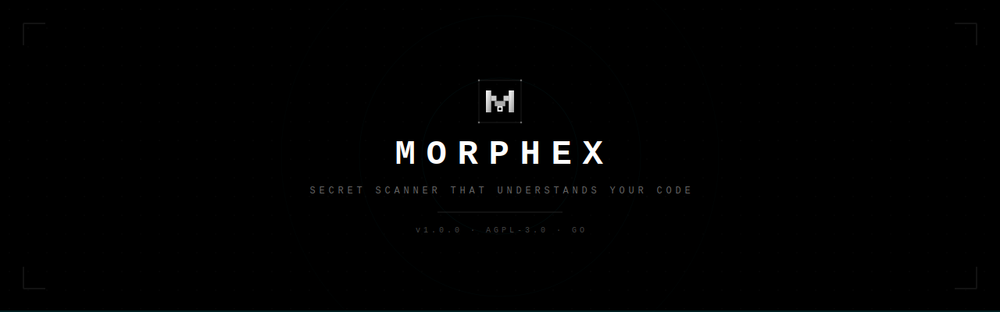

<div align="center">
  

# MORPHEX

**A secret scanner that reads code, not just strings.**

Other scanners run regex and dump everything that looks vaguely like a key.<br>
Morphex actually looks at the variable name, the file, the context — and only tells you about real secrets.

[Quick Start](#quick-start) · [How It Works](#how-it-works) · [CI/CD](#cicd-integration) · [Benchmarks](#benchmarks) · [Docs](https://morphex.sh/docs)

---

[](LICENSE)
[](https://goreportcard.com/report/github.com/morphex-security/morphex)

</div>

## Why

If you've used a secret scanner before, you've probably seen the pattern: 200 findings, 198 are junk. Test keys, example values from docs, encryption constants that aren't API secrets, hashes that aren't tokens. You triage them all, find two real ones, and mentally check out the next time the scanner runs.

That's how real leaks slip through. Not because the scanner didn't find them — but because nobody reads the 200th alert.

Morphex works differently. It doesn't just ask "does this look like a key?" — it looks at what the variable is called, what kind of file it's in, whether there's a comment saying it's revoked, whether the import on line 3 is a crypto library. It pieces the context together the same way you would if you were reading the code yourself.

If it can't make a confident call, it stays quiet. You only hear from it when something's actually wrong.

## Quick Start

```bash
# Install (macOS / Linux)
brew install morphex-security/tap/morphex

# Or build from source
git clone https://github.com/morphex-security/morphex.git
cd morphex && make build

# Scan a directory
morphex scan .

# Scan git history
morphex scan-git .

# Scan from stdin
cat .env | morphex stdin
```

No config files to write. No API keys to set up. Just point it at your code.

## How It Works

Regular scanners do: `regex match → report`. That's it. If the string matches a pattern, you get an alert whether it's a real key or not.

Morphex does something different. Before it tells you anything, it runs every candidate through five checks:

| What it checks | What that means | Example |
|---|---|---|
| **Variable name** | Is this thing called `api_key` or `build_number`? | `DB_PASSWORD` = suspicious. `RETRY_COUNT` = not. |
| **Value shape** | Does the value look machine-generated or human-typed? | `sk_live_4eC39Hq...` has a known prefix. `hello world` doesn't. |
| **File type** | Is this a production config or a test file? | `.env` = high risk. `test_fixtures/` = low risk. |
| **Line context** | What's the code around it doing? | Assignment = real. Comment saying "revoked" = not. |
| **Entropy** | How random is it? | Random 40-char string = likely key. `localhost:5432` = not. |

Then it runs seven more filters to catch things like template references (`${SECRET}`), known example keys from AWS docs, encryption constants in crypto libraries, and credentials that comments say have been rotated.

What's left after all that is almost always a real secret.

## Obfuscation Detection

People split secrets across variables. They base64-encode them. They reverse strings, build them from byte arrays, pass them through ROT13. Sometimes on purpose, sometimes by accident. Either way, normal scanners don't catch any of it.

Morphex does. With `--deep`, it traces values across assignments, decodes encoded strings, and reconstructs the original secret before classifying it.

```python
# String concatenation
prefix = "sk_live_"
key = prefix + "4eC39HqLyjWDarjtT1zdp7dc"

# Variable interpolation
base = "ghp_"
token = f"{base}ABCDEFghijklmnop1234567890"

# Reversed string
secret = "cd7pdz1TjraDjWyL9qH3Ce4_evil_ks"[::-1]
```

To enable the advanced extraction engine, use the `--deep` flag:
```bash
morphex scan --deep /path/to/code
```

## CLI Reference

```bash
morphex scan <path>              # Scan file or directory
morphex scan-git <repo>          # Scan git history
morphex stdin                    # Scan from stdin
morphex version                  # Show version info
morphex completion <shell>       # Generate shell completions (bash/zsh/fish)
morphex generate-key             # Generate API keys
morphex serve                    # Start API server
```

### Scan Flags

```text
--json                  Output JSON
--sarif                 Output SARIF v2.1.0 (GitHub Code Scanning)
--github-actions        Output GitHub Actions annotation format
--threshold N           Confidence threshold (default: 0.7)
--deep                  Enable obfuscation detection (concat, base64, ROT13, etc.)
--fail                  Exit code 1 if secrets found (CI gating)
--force-skip-binaries   Skip binary files
--baseline PATH         Suppress known findings
--create-baseline       Save current findings as baseline
--policy PATH           Custom scan policy (JSON)
--workers N             Concurrent workers (default: auto)
--redact N              Redaction level 0-100 (default: 100)
--include GLOBS         File patterns to include
--exclude GLOBS         File patterns to exclude
--model-dir PATH        DistilBERT ONNX model directory for ML classification
```

### Shell Completions

```bash
eval "$(morphex completion bash)"    # bash
eval "$(morphex completion zsh)"     # zsh
morphex completion fish | source     # fish
```

## CI/CD Integration

### GitHub Actions

```yaml
name: Secret Scan
on: [push, pull_request]
jobs:
  morphex:
    runs-on: ubuntu-latest
    steps:
      - uses: actions/checkout@v4
      - uses: morphex-security/morphex@v1
        with:
          path: '.'
          deep: 'true'
          sarif: 'true'
          fail-on-findings: 'true'
```

With SARIF enabled, results are automatically uploaded to GitHub Code Scanning.

### Pre-commit Hook

```yaml
# .pre-commit-config.yaml
repos:
  - repo: https://github.com/morphex-security/morphex
    rev: v1.0.0
    hooks:
      - id: morphex            # fast scan (< 30ms)
      - id: morphex-deep       # deep scan with obfuscation detection
```

### Docker

```bash
docker run --rm -v $(pwd):/src morphexsecurity/morphex scan /src
```

## Performance

Fast enough for pre-commit hooks. A 100-file repo scans in under 3 milliseconds. Git history with thousands of commits finishes in under a second. We're not kidding — the engine was built from the ground up to run at the speed of `git status`, not the speed of "go make coffee."

## Benchmarks

Don't trust our numbers. Run them yourself: `make benchmark`

We built a 30-case adversarial test suite specifically designed to break secret scanners — obfuscated secrets, deliberately ambiguous non-secrets, and every edge case we could think of. Here's what happened:

| Metric | Morphex | Gitleaks | TruffleHog |
|---|---|---|---|
| **True Positives** | **19/19 (100%)** | 8/19 (42%) | 5/19 (26%) |
| **False Positives** | **0** | 4 | 1 |
| **F1 Score** | **1.00** | 0.52 | 0.40 |
| **Obfuscation cases** | **7/7** | 2/7 | 2/7 |

### What Morphex catches that others miss

| Secret Type | Morphex | Gitleaks | TruffleHog |
|---|---|---|---|
| Generic `DB_PASSWORD` in .env | **Found** | Missed | Missed |
| Redis connection string | **Found** | Missed | Missed |
| HuggingFace `hf_` token | **Found** | Missed | Missed |
| Cross-variable concat | **Found** | Missed | Missed |
| Base64-encoded secret | **Found** | Found | Found |
| Python `[::-1]` reversal | **Found** | Missed | Missed |
| Bearer token in curl string | **Found** | Found | Missed |
| `codecs.decode` ROT13 | **Found** | Missed | Missed |
| `bytes([0x73,0x6b,...])` array | **Found** | Missed | Missed |
| Revoked key (context-suppressed) | **Correct: suppressed** | FP: flagged | FP: flagged |

### Speed

| Scan Type | Morphex | TruffleHog | Gitleaks |
|---|---|---|---|
| 99-file repo | **2.6ms** | 300ms | 18ms |
| Git history | **437ms** | 477ms | — |
| Single stdin line | **26ms** | 1,709ms | — |
| Cold start | **23ms** | 798ms | ~100ms |